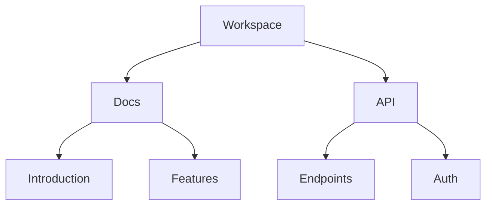

## Overview

Oleg Gostev provides powerful tools to streamline your documentation workflow. You create, organize, collaborate, and search with ease. Start by exploring the core capabilities below.

<Columns cols={2}>
  <Card title="Document Creation" icon="edit-3" href="#document-creation">
    Build rich docs with Markdown and MDX support.
  </Card>
  <Card title="Organization" icon="folder" href="#organization">
    Structure content in folders and pages.
  </Card>
  <Card title="Collaboration" icon="users" href="#collaboration">
    Share securely with granular permissions.
  </Card>
  <Card title="Search Tools" icon="search" href="#search">
    Find content quickly with advanced filters.
  </Card>
</Columns>

## Document Creation and Editing

Create new documents directly from the dashboard. You edit in real-time with live preview, supporting Markdown, MDX components, and syntax highlighting.

<Steps>
  <Step title="Create Document" icon="plus">
    Click the `New Document` button. Choose a template or start blank.
  </Step>
  <Step title="Edit Content" icon="edit">
    Use the split-pane editor. Add headings, lists, and code blocks.
  </Step>
  <Step title="Preview and Publish" icon="eye">
    Toggle live preview. Hit `Publish` to make it live.
  </Step>
</Steps>

Here is a sample MDX code block you add:

````mdx
```javascript
function createDoc(title) {
  return {
    id: `doc-${Date.now()}`,
    title,
    content: `# ${title}\n\nYour content here.`
  };
}
```
````

<Callout kind="tip">
  Enable auto-save to avoid losing work. It runs every `{30s}`.
</Callout>

## Folder and Page Organization

Organize your docs hierarchically. Create folders to group related pages, with drag-and-drop reordering.



Use the sidebar to navigate. Nest pages up to five levels deep for complex projects.

## Collaboration and Sharing Permissions

Invite team members and set permissions per folder or page. Control who views, edits, or admins.

<Tabs>
  <Tab title="View Only" icon="eye">
    Readers access content without changes. Ideal for public docs.
  </Tab>
  <Tab title="Editor" icon="edit-3">
    Full editing rights. Use for internal teams.

    ```javascript
    // Share link example
    const shareUrl = "https://docs.example.com/workspace/docs/features";
    ```
  </Tab>
  <Tab title="Admin" icon="shield">
    Manage users and settings. Grant sparingly.
  </Tab>
</Tabs>

<Expandable title="Advanced Permissions" default-open="false">
  Set role-based access with custom groups. Integrate with SSO for enterprise.
</Expandable>

## Search and Filtering Tools

Search across all docs instantly. Filter by tags, authors, or dates.

| Filter Type | Description | Example |
|-------------|-------------|---------|
| Keyword | Full-text search | `features` |
| Tag | Filter by labels | `api`, `internal` |
| Author | By creator | `john.doe@example.com` |
| Date | Created/updated | `>2024-01-01` |

<CodeGroup tabs="Advanced Query">
  ```javascript
  // API search example
  const results = await search({
    query: "features",
    filters: { tags: ["guide"], date: { gte: "2024-01-01" } }
  });
  ```
</CodeGroup>

Master these features to boost your team's productivity. Explore [quickstart](/quickstart) for hands-on setup.